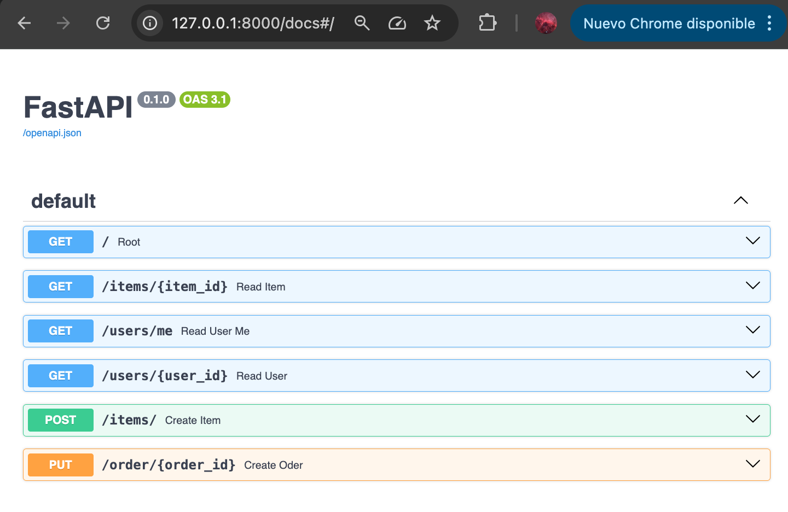
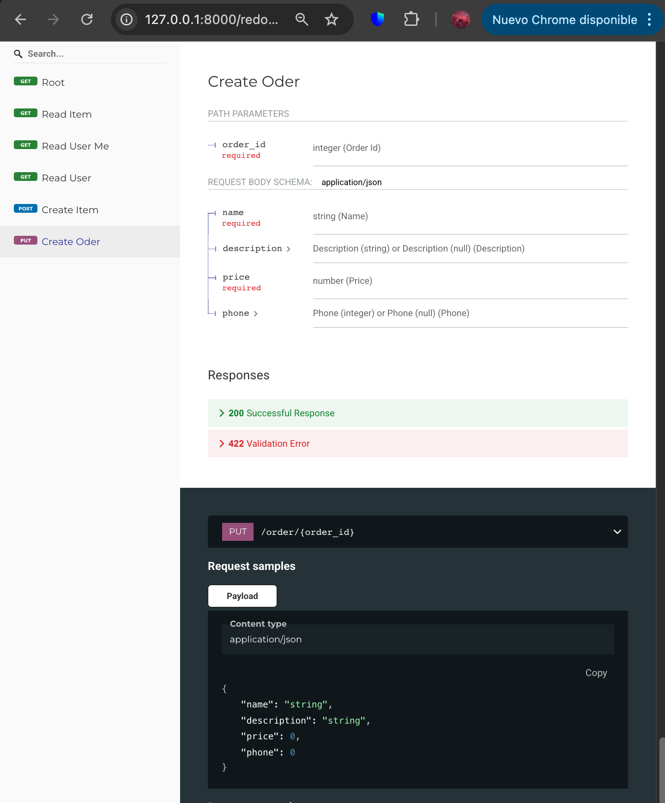

## Fast API POC: Building Python web API

### Description
Testing basic Fast API functionality, using Uvicorn to run locally the HTTP server.

##### Versions:

`fastapi           0.115.12`
`uvicorn           0.34.0`

### Usage
```
$ uvicorn main:app --reload
```
Main endpoint: `http://127.0.0.1:8000`

#### Interactive API documentation (Swagger UI)
`http://127.0.0.1:8000/docs`




#### Alternative interactive API documentation (Redoc)
`http://127.0.0.1:8000/redoc`




### Reference
https://realpython.com/fastapi-python-web-apis/